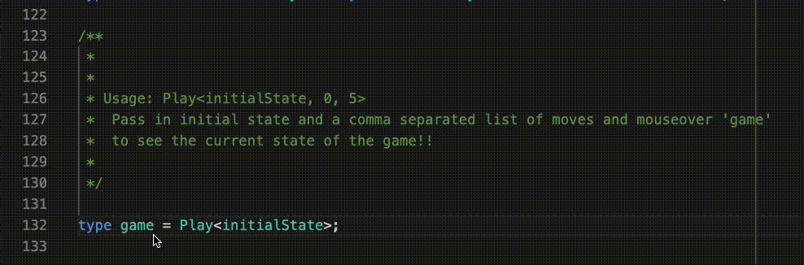

# Tic Tac Toe AI Written in Typescript Type System

This is a complete tic tac toe implementation, complete with computer player written entirely in typescript types.

## To do

- It doesn't play perfectly right now (there's four forking plays that can beat it)
- Could do with better error messaging on invalid moves
- Currently causes TS Language server to crash occasionally in VSCode and every single time in [TS Playground](https://www.typescriptlang.org/play) 😂

## Inspiration

- [ts-sql](https://github.com/codemix/ts-sql)
- [json-parser-in-typescript-very-bad-idea-please-dont-use](https://github.com/jamiebuilds/json-parser-in-typescript-very-bad-idea-please-dont-use)
- [tic-tac-toe in ts implementation](https://medium.com/@bakeds/play-tic-tac-toe-with-the-help-of-advanced-types-in-typescript-dc18858b2504) - Borrowed a lot of the ideas here!
- [css-tic-tac-toe](https://github.com/lukebatchelor/css-tic-tac-toe) (cheeky self promotion)

## Other cool links

- [Typscript Handbook Advanced types](https://www.typescriptlang.org/docs/handbook/advanced-types.html)
- [ronami/meta-typing](https://github.com/ronami/meta-typing)
- [piotrwitek/utility-types](https://github.com/piotrwitek/utility-types)
